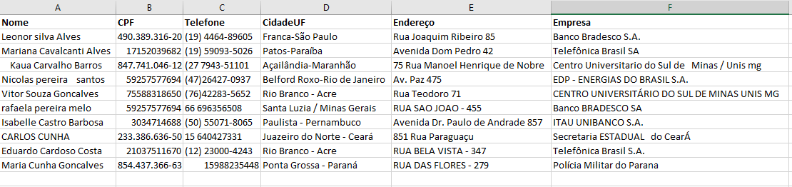
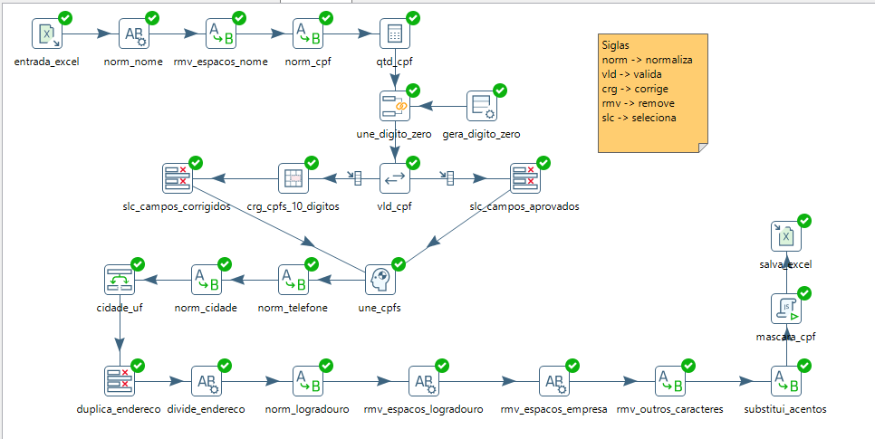
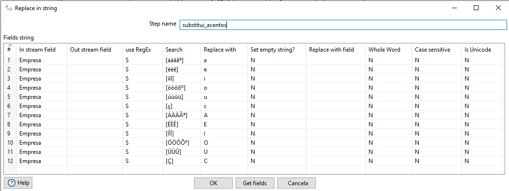
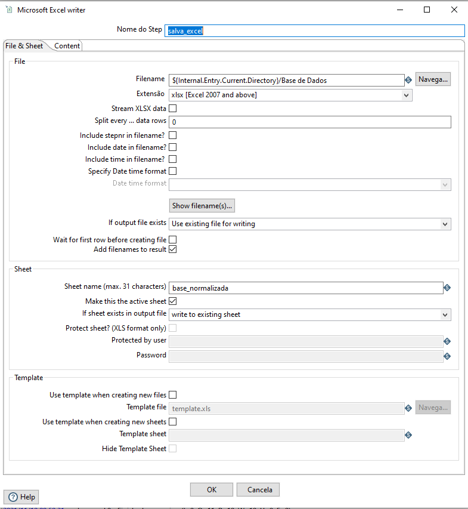
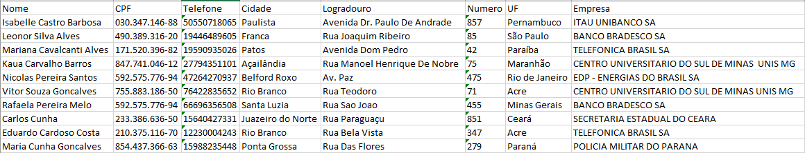

# PDI-Trabalhando-com-Strings

## Objetivo
O objetivo deste case foi atender o convite do Prof. <a href="https://br.linkedin.com/in/nelson-silva-3b82434b">Nelson Silva</a> de realizar uma demonstração para alguns alunos de Pós Graduação do Centro Universitário do Sul de Minas sobre o dia a dia de um Analista de BI/Analista de Dados, normalizando, padronizando e enriquecendo informações. Desse modo, foi elaborada essa situação fictícia utilizando o Pentaho Data Integration. 

A situação consiste em ler dados despadronizados presentes em um arquivo excel e realizar o máximo de padronização e tratamento possível. 

Podemos observar como os dados estão sem qualidade, seja nos nomes, na quantidade de dígitos de CPF, telefone, endereço, etc.

## Resolução

Para resolução destes dados, foi criada a transformação abaixo com diversos tratamentos 

Essa transformação realiza validações nos digítos do CPF, nos nomes, endereços, remoção de acentos, dentre outras, e por fim, salva os dados tratados em uma nova aba do arquivo excel utilizado para leitura dos dados

## Comentários

### Regex
Uma das funções mais interessantes no Pentaho Data Integration, em minha opinião é a possibilidade de aplicar expressões regulares em alguns steps, como foi o caso para validar caracteres com acentos e fazer sua substituição para uma unificação de dados.

### Microsoft Excel writer

A flexibilidade em salvar os dados no mesmo arquivo também se torna muito interessante em situações nas quais são exigidas automações, controles, governança, etc. 

Para isso, o step Microsoft Excel writer é capaz de realizar esse tipo de carga. 

### Resultado final do tratamento dos dados

## Como replicar este case

Para replicar este case, basta realizar o clone ou download deste repositório e utilizar o Pentaho Data Integration na versão 9.1 visto que é a versão utilizada para o desenvolvimento deste cenário. Por fim, torna-se necessário verificar e trocar os diretórios de leitura e escrita do arquivo excel para que a ferramenta encontre o arquivo na sua máquina. 

